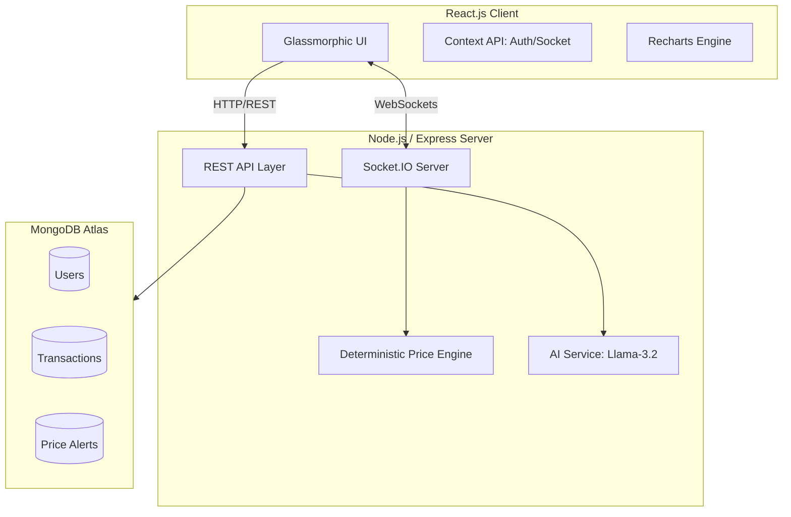

# Live Stock Market Simulator 

A premium, full-stack stock market simulation platform tailored for the **Indian Equity Market (NSE)**. This platform allows users to trade Nifty 50 stocks with virtual capital, leverage AI-driven insights for decision-making, and track real-time portfolio performance with high-fidelity analytics.


## System Architecture




## Instant Demo
The application features a **One-Click Instant Demo** mode. No registration is required— users can jump straight into the dashboard with pre-seeded data to experience the full feature set immediately.


## Premium Features

### AI-Powered Intelligence
*   **AI Chatbot**: Intelligent assistant powered by **Llama-3.2** to help with trading strategies and market concepts.
*   **Portfolio Analysis**: Deep AI evaluation of your holdings with risk scoring and diversification suggestions.
*   **Market Sentiment**: Real-time AI summarization of stock-specific news with sentiment classification.
*   **AI Learning Hub**: Personalized AI tutor to master stock market concepts from beginner to advanced levels.

### Professional Analytics
*   **High-Fidelity Charts**: Interactive Area Charts powered by Recharts with multi-timeframe support (1D to 3YRS).
*   **Live Order Book**: Real-time price updates via **Socket.io** ensuring millisecond-level synchronization with our deterministic price engine.
*   **Performance Tracking**: Accurate calculation of Realized P&L, Unrealized Gains, and Day's G/L including intraday realized profits.

### Indian Market Focus
*   **NSE Data Integration**: Real-time tracking of Nifty 50 companies with authentic corporate logos and market indices.
*   **Dynamic Simulation**: Prices move realistically using a random-walk algorithm with momentum and volatility scaling specifically tuned for INR values.


## Tech Stack

| Layer | Technologies & Packages |
| :--- | :--- |
| **Frontend** | React.js (v19), Tailwind CSS, **Framer Motion**, **Recharts**, Lucide Icons |
| **Backend** | Node.js, Express.js (v5), **Mongoose**, **JWT**, **Helmet** (Security) |
| **Database** | MongoDB (Cloud Atlas) |
| **Real-time** | **Socket.io** (Bi-directional live feed synchronization) |
| **AI Integration** | **Llama-3.2** via Hugging Face Inference API |


## Technical Challenges Overcome

### 1. High-Frequency Real-Time Updates
**Challenge**: Broadcasting live prices for 50+ stocks every second to all connected users without crashing the event loop.
**Solution**: Implemented a batch-update system in the `stockService` that optimizes Socket.io broadcasts and uses a deterministic price engine to maintain consistency across all clients.

### 2. Complex Financial Calculations
**Challenge**: Accurately calculating "Realized Profit Today" vs "Total Realized Profit" in a stateless environment.
**Solution**: Engineered a robust Transaction schema that logs precise entry/exit points, allowing for real-time aggregation of P&L metrics via MongoDB pipelines.


## Quick Start

### Prerequisites
- Node.js (v18+)
- MongoDB Atlas account (Cloud) or local MongoDB instance
- Hugging Face API Key (for AI features)

### One-Command Deployment (Production)
The backend is configured to serve the frontend automatically in production mode.
1. Build the frontend: `cd frontend && npm install && npm run build`
2. Setup backend: `cd ../backend && npm install`
3. Set `NODE_ENV=production` in your `.env`
4. Start: `npm start`


## Project Structure

```bash
├── backend/
│   ├── controllers/     # Business logic for all API endpoints
│   ├── models/          # Mongoose Schemas (User, Portfolio, Transaction, Alert)
│   ├── routes/          # Express API routes
│   ├── services/        # AI (Hugging Face) & Real-time Stock Engine
│   └── server.js        # Entry point with Helmet & Static Serving
├── frontend/
│   ├── src/
│   │   ├── api/         # Axios & Socket client logic
│   │   ├── components/  # Reusable UI & Charting components
│   │   ├── context/     # Global state (Auth, Toast, Socket)
│   │   └── pages/       # High-level page views (Dashboard, Market, AI Learn)
└── README.md
```


## Contributors

*   **Vamshi Krishna Kommu** (24EG105F33)
*   **Abhiram Valmeekam** (24EG105H01)
*   **Abhishikth Paul Ganta** (24EG105H02)
*   **Dingari Vikram** (24EG105K19)
*   **Kandlakuntla Bharadwaj** (24EG105K27)


