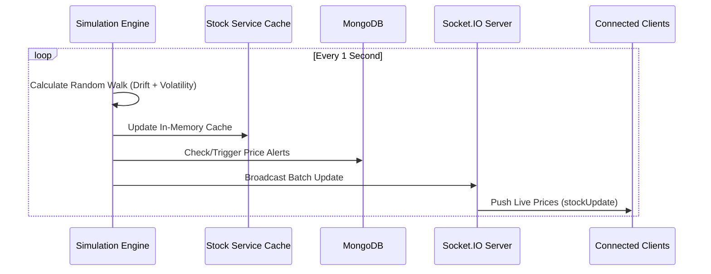

# StockSim AI Backend

The robust server-side engine powering real-time Indian stock market simulation and AI-driven financial insights.

---

## 🔄 Data Flow & Price Simulation



---

## 🚀 Core Services

### Real-Time Price Engine
Located in `services/stockService.js`, this engine eliminates the need for expensive third-party APIs by simulating a deterministic random-walk model for Nifty 50 stocks. 
*   **Momentum Scaling**: Prices are adjusted based on historical volatility tiers.
*   **INR Accuracy**: Precision-tuned for Indian Rupee denominations.
*   **Session Persistence**: Keeps the last 100 data points in memory for instant chart hydration.

### AI Financial Layer
Integration with **Hugging Face (Llama-3.2)** provides:
- **Automated Portfolio Risk Analysis**: Evaluates asset concentration.
- **Sentiment Scrubbing**: Cleans and summarizes raw financial headlines.
- **Dynamic Learning**: Generates contextual explanations for market terminology.

---

## 📦 Key Dependencies

| Package | Purpose |
| :--- | :--- |
| **express** | Core web framework (v5) |
| **mongoose** | MongoDB object modeling and schema validation |
| **socket.io** | Real-time WebSocket server for live price broadcasts |
| **jsonwebtoken** | Secure stateless authentication via JWT |
| **bcryptjs** | Industrial-grade password hashing |
| **helmet** | Production-ready security headers |
| **cors** | Configurable cross-origin resource sharing |
| **@huggingface/inference** | Direct integration with Llama-3.2 AI models |

---

## 🛡️ Security & Scalability

- **Helmet**: Secures the app by setting various HTTP headers.
- **JWT**: Stateless authentication for secure session management.
- **CORS**: Flexible, environment-aware cross-origin policy.
- **Static Serving**: In production, the backend automatically serves the frontend build from `../frontend/dist`.

---

## 📡 API Endpoints

| Route | Description | Auth |
| :--- | :--- | :--- |
| `/api/auth` | Login, Register, Guest Access | No |
| `/api/stocks` | Live and Historical Stock Data | Yes |
| `/api/trade` | Order Execution (Buy/Sell) | Yes |
| `/api/ai` | Insights, Learning, and Analysis | Yes |
| `/api/portfolio` | Holdings and P&L Tracking | Yes |

---

## ⚙️ Setup & Configuration

1. **Environment**: Create a `.env` file based on the template:
   ```env
   PORT=5000
   MONGO_URL=your_mongodb_atlas_uri
   JWT_SECRET=your_secret
   HUGGINGFACE_API_KEY=your_key
   NODE_ENV=production
   FRONTEND_URL=http://localhost:5173
   ```
2. **Install**: `npm install`
3. **Run**: 
   - Dev: `npm run dev`
   - Prod: `npm start`

