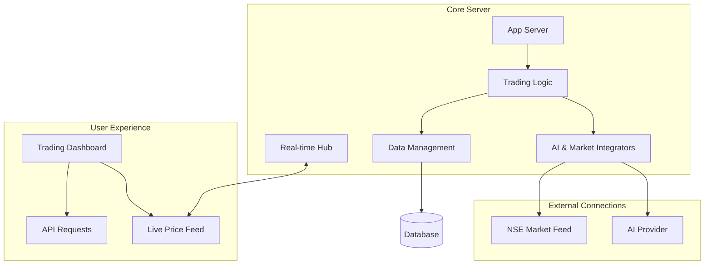

# Technical Architecture

The Live Stock Market Simulator follows a decoupled MERN stack architecture with real-time bi-directional communication.

## System Overview

The simulator is built using a modern 3-tier architecture. The **Frontend** handles the user experience, the **Backend** processes all trading logic, and **External Services** provide live market data and AI intelligence.

## Core Components

### 1. Data Flow (Real-time)

The system uses **Socket.io** to push live price updates from the server to all connected clients.
- The server polls or receives market data from a stockService.
- It emits priceUpdate events to a global or room-based namespace.
- The frontend SocketContext listens for these events and updates the global livePrices state.

### 2. AI Integration Layer

The aiService acts as a wrapper around advanced LLMs (like Google Gemini).
- **Prompt Engineering**: System instructions are crafted to ensure the AI returns structured JSON or clean markdown.
- **Context Management**: For portfolio analysis, the user's specific holdings are passed as context to the model.

### 3. State Management

- **Frontend**: Uses React Context API (AppContext, SocketContext, ToastContext) for global state, avoiding prop-drilling.
- **Persistence**: MongoDB stores user profiles, portfolio snapshots, and a full audit trail of transactions.

## Security

- **JWT (JSON Web Tokens)**: Used for stateless authentication.
- **Bcrypt**: For secure password hashing.
- **Protected Routes**: Middleware verifies tokens before allowing trades or profile updates.
