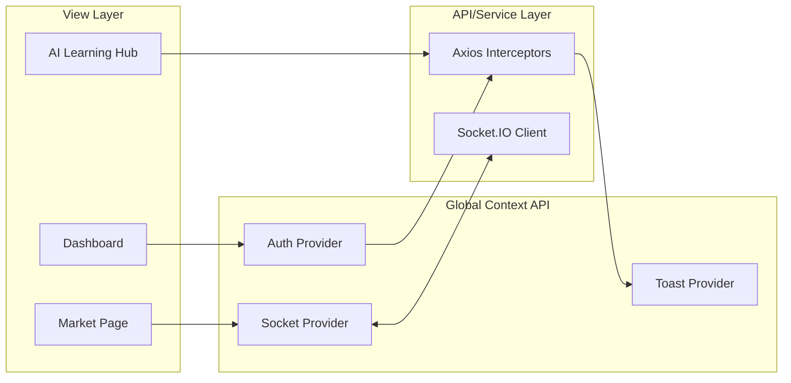

# StockSim Frontend

A premium, glassmorphic UI built with React.js, designed to provide an institutional-grade trading experience for the Indian stock market.


## Design System & State Flow




## Key UX Features

### Institutional-Grade UI
- **Glassmorphism**: Sleek, translucent interface using Tailwind's backdrop-blur and custom gradients.
- **Micro-animations**: Smooth transitions and hover effects powered by **Framer Motion**.
- **Responsive Charts**: Crosshair-enabled area charts for technical analysis.

### Real-Time Synchronization
- **Socket.io Integration**: Subscribes to live price feeds (`stockUpdate`) to update portfolios and order books instantly without page refreshes.
- **Dynamic P&L**: Unrealized profit/loss updates every second based on live market volatility.

### AI Learning Integration
- **Interactive Tutor**: Specialized interface for conversing with Llama-3.2 about market mechanics.
- **Smart Insight Cards**: Per-stock AI summaries rendered from high-fidelity Markdown.


## Key Libraries

| Package | Purpose |
| :--- | :--- |
| **react** | Core UI library (v19) |
| **react-router-dom** | Declarative routing for Single Page Application (SPA) |
| **tailwindcss** | Utility-first CSS framework for modern styling |
| **framer-motion** | Production-ready animations and gesture library |
| **recharts** | Composable charting library for financial data visualization |
| **socket.io-client** | Real-time WebSocket client for live data sync |
| **axios** | Promise-based HTTP client for API communication |
| **react-markdown** | Component to render AI-generated markdown safely |
| **lucide-react** | Beautiful and consistent icon set |


## Installation & Development

1. **Install dependencies**:
   ```bash
   npm install
   ```
2. **Setup environment**:
   Create a `.env` in the root (optional if running via the backend server):
   ```env
   VITE_API_URL=http://localhost:5000
   ```
3. **Run Development Server**:
   ```bash
   npm run dev
   ```
4. **Build for Production**:
   ```bash
   npm run build
   ```